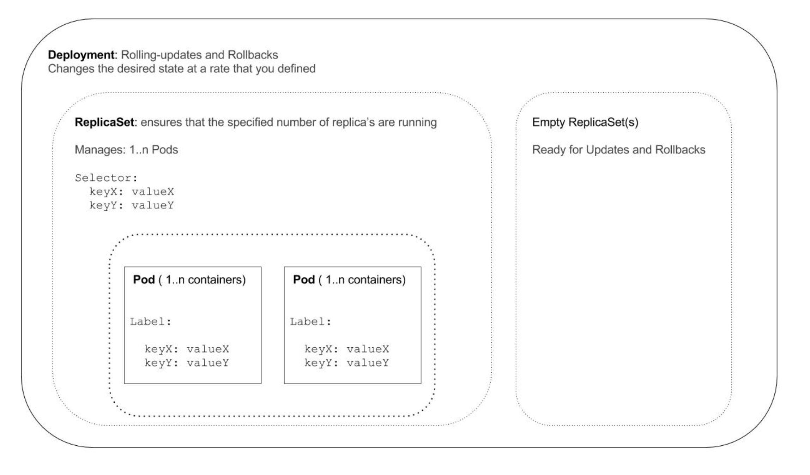

## Deployments

### Concept ###

As you have seen in the previous section, a `Pod` is pretty useless on its own. This is also why we would typically deploy Pods within a higher level construct (a "wrapper").

Its purpose is to ensure that a specified number of pod replicas are running as well as rolling-updates or rollbacks.

`Deployment` is a wrapper around a `ReplicaSet`, which on its turn wraps around `Pods`.



The `Deployment` object enforces the desired state and makes sure that the change towards this desired state happens at a controlled rate.
Example:

```
My application currently has 5 Pod replica's.
Update my application's image from foobar:1.0 to foobar:1.1.
While replacing old pods during a rolling-update,
ensure that the number of pods does not exceed / fall below the specified replica's amount by 1.
(In other words, there will be no more than 6 nor less than 4 at any given time)
And ensure there is a period of 3 second between rolling out a new pod.
```

### Manifest ###

The manifest for a `Deployment` is required to supply the template for your Pod.

Besides of that, you'd typically also define:
- the number of [replicas](https://kubernetes.io/docs/concepts/workloads/controllers/deployment/#replicas) (which will become an attribute of the wrapped `ReplicaSet`)
- the [strategy](https://kubernetes.io/docs/concepts/workloads/controllers/deployment/#strategy) for deployment

Example:

```yml
# tasman-deploy-1.yml
apiVersion: extensions/v1beta1
kind: Deployment
metadata:
  name: tasman                        # name of your Deployment
spec:
  replicas: 4
  # Wait x amount of seconds after a new pod comes up, before you mark a pod as ready and move on
  minReadySeconds : 3
  strategy:
    type: RollingUpdate               # Default value is RollingUpdate
    rollingUpdate:
      maxUnavailable: 1               # 1 pod down at a time
      maxSurge: 1                     # Never have 1 pod more than the specifed replicas-amount

  template:                           # define your Pod here
    metadata:
      # the labels here are not only applied to the pods,
      # but also supplied to Deployment and RS as selectors
      labels:
        app: tasman
    spec:
      containers:
      - name: tasman                  # name of your container
        image: actfong/tasman:1.0
        ports:
          - containerPort: 4567

```

Now you can deploy with:
```
kubectl apply -f tasman-deploy-1.yml
```
Congratulations, you have just deployed with Kubernetes!

Since we already setup a `Service` object with selectors that match the labels of our Pods, you should be able to access the application from your browser.

On the main page, you should see that *Abel is travelling from Batavia to Mauritius* and there is a link for you to check the current version of the app.

Now inspect your `Deployment`, `ReplicaSet` and `Pod` with `kubectl get` and `kubectl describe` and pay attention to the following:

- Your `Deployment` object, will have `Selectors` which were supplied to your Pod template as `labels`
- Your RS's names are prefixed with the name of your Deployment. You will also see that within your RS, the values for `Replicas`, `Labels` and `Selectors` are same as specified in the Deployment's manifest.


### Rolling Update ###

Now you have seen how to deploy, how about updating your app?

When we deploy a newer version of our app, that means we need to deploy a newer version of our application's image.
So, this is simply a matter of you changing the image within the specs of your container.

In our case, let's create a new version of the app and then deploy it.

When you deploy for the first time, K8s created a `ReplicaSet` for you to hold your pods.
When you deploy an update, it will use (or create) another `ReplicaSet` to control the new pods. Then, while it tears down the old Pods in the first ReplicaSet, it spins up new pods in the new ReplicaSet

The following section in the manifest is related to this mechanism:

```
  minReadySeconds : 10                # wait 10 sec after spinning up before moving on to next pods
  strategy:
    type: RollingUpdate               # Default value is RollingUpdate
    rollingUpdate:
      maxUnavailable: 1               # 1 pod down at a time
      maxSurge: 1                     # Never have 1 pod more than the specifed replicas-amount
```

The `RollingUpdate` [strategy](https://kubernetes.io/docs/concepts/workloads/controllers/deployment/#strategy) means that the old pods get replaced gradually by the new pods.

The `maxUnavailable` and `maxSurge` parameters define how much below or above the specified replicas number we can go during the deploy. With `minReadySeconds`, we specify how long a Pod should have been running before we move on with spinning up the next one.

To see what is different between our two manifest files, use 
```
diff tasman-deploy-1.yml tasman-deploy-2.yml
```

For Kubernetes to show you what will change when deploying `tasman-deploy-2.yml`, use:
```
kubectl diff -f tasman-deploy-2.yaml
```


The `kubectl apply` command can be used to update K8s resources, including `Deployment`. But this time, when you deploy this update, please add the `--record` flag. I will explain it to you later.

```
kubectl apply -f tasman-deploy-2.yml --record
```

If you want to know the status during the rollout, you can check with:
```
kubectl rollout status deployment tasman
```

To verify that you have indeed deployed the updated version: check the app through your browser again: you should see that where Abel is traveling from/to has changed (from Mauritius to Van Diemens's Land). Same goes for the link showing you the current version (2).

Also, could you list and inspect the ReplicaSets with `kubectl get` and `kubectl describe`?

You should now see two RS's and that the old RS has no pods within it. When you inspect the new pods, you should also see that its container has the new image.


### Rollbacks and History ###

K8s keeps track of revisions of your `Deployment` objects, which you can see with:
```
kubectl rollout history deployment/tasman
```

In our case, we should see 2 revisions. You should also see that the second revision has a value for the `CHANGE-CAUSE`. This is because with your last deployment, the `--record` flag was added.

These revision also shows us the attributes of our deployment, such as which image was deployed. You can inspect that with:

```
kubectl rollout history deployment/tasman --to-revision={revision-number}
```

These revisions in K8s allow us to perform a rollback easily. Not only to previous version, but also further in the past.

Rollback can be performed with

```
kubectl rollout undo deployment/{deploy-name}                               # rollback by 1 revision
kubectl rollout undo deployment/{deploy-name} --to-revision={revision-number}  # rollback to a specific revision
```

### What you have learned in this section ###

In this section, you have learned how to:
1. Deploy an update
2. Perform a rollback
3. And how to inspect the revisions of your deployment

Now that your app is up-and-running, the next step is to scale up your application to take on whatever the Internet will throw at you.
